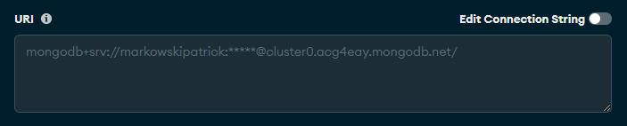
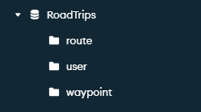
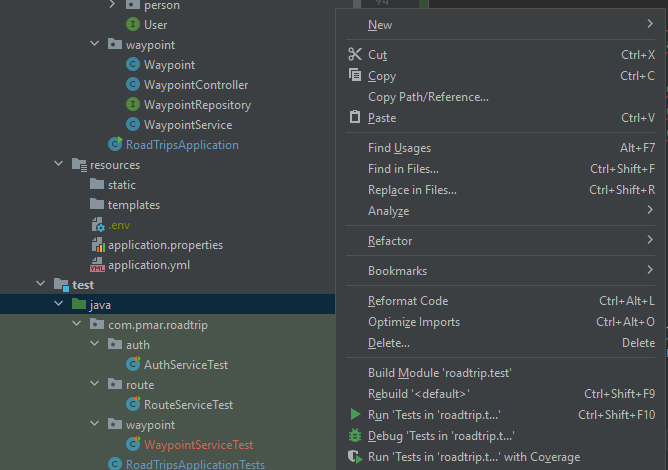

## This is my fullstack app, an idea I came up with during my road trip from Illinois to California
 

<h1 align="center">Getting started</h1>
 

## This app needs a few things to get started:

- ### A [MongoDB](https://account.mongodb.com/account/login) account
- ### The [frontend](https://github.com/aphex29/RoadTrips-frontend) repo forked and setup (instructions in there)
- ### This repo forked
- ### A [Google Maps](https://developers.google.com/maps) API key

<h1 align="center">MongoDB</h1>
 
<h2>
After creating an account on MongoDB, download MongoDB Compass. 
There you will create a new cluster as well as the database that 
will be in primary use in the application
</h2>

 

<h3>
Take note of your URI that you connect to, as you'll need it later

 

 

The database name is RoadTrips, and the Collections are named "route", "user", "waypoint"
in order 

 

</h3>

<h2 align="center">Setting up the backend</h2>

 

<h3>
After forking the backend, make sure that all the dependencies 
are downloaded and running locally (and do a gradle clean build).

 

 

Create a .env file under "./resources/".
 

In there, please create the following variables and set 
them to the values in accordance to the URI pictured above:

 

    API_KEY = "Your_google_API_key"
    DATA_USER = "Your_database_username"
    DATA_PASS = "Database_password"
    DATA_CLUSTER = "Cluster link (starting after the @ and ending with .net)"
    DATABASE = "Database_name (mine was RoadTrips)"

 

After that, create an application.yml file inside of "./resource/", structured like this:

 

    spring:
        data:
            mongodb:
                uri: mongodb+srv://${env.DATA_USER}:${env.DATA_PASS}@${env.DATA_CLUSTER}/${env.DATABASE}

 

Finally, create an application.properties file inside of "./resource/" with the following:

 

    spring.data.mongodb.uri = mongodb+srv://${env.DATA_USER}:${env.DATA_PASS}@${env.DATA_CLUSTER}?retryWrites=true&w=majority
    spring.data.mongodb.database=RoadTrips
    server.port=8080
    spring.jpa.properties.hibernate.show_sql=true
    spring.jpa.properties.hibernate.use_sql_comments=true
    spring.jpa.properties.hibernate.format_sql=true

 

</h3>

<h2>
If you want to run my prewritten tests or add more to it, feel free to test them out by right clicking 
"java" under "src/test" and pressing "Run tests in roadtrips.test"
</h2>

 

<h3>
To start the application on the backend, simply head over to "main/java/com/pmar/roadtrip/"and run RoadTripsApplicaiton.java. By default it will run on the 8080 port but feel free to change 
this in the application.properties file
</h3>